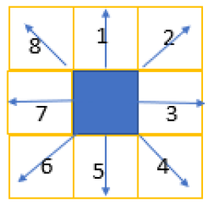

# Hunger-Games
 Hunger Games "board game" made in Java. This was made as a university assignment, on the subject of Data Structures.
 
 ## How it works
 This version is made with 3 types of players included:
 1. Random Player: Every move made is decided by a random number generator
 2. Heuristic Player: They have a range *r = 2* in which they are able to see. Their moves are decided via simple position evaluation algorithms.
 3. MinMax Player: The range *r* they can see in is "infinite" (equal to the size of the board). Their moves are dictated by a MinMax tree, whose first level contains the available moves of the player and second level corresponds to the opponent's available moves after each "copy of a move" on the first level has taken place.

