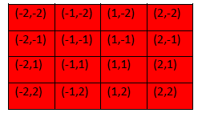

# Hunger-Games
 Hunger Games "board game" made in Java. This was made as a university assignment, on the subject of Data Structures.
 
 ## How it works
 This version is made with 3 types of players included:
 1. Random Player: Every move made is decided by a random number generator
 2. Heuristic Player: They have a range *r = 2* in which they are able to see. Their moves are decided via simple position evaluation algorithms.
 3. MinMax Player: The range *r* they can see in is "infinite" (equal to the size of the board). Their moves are dictated by a MinMax tree, whose first level contains the available moves of the player and second level corresponds to the opponent's available moves after each "copy of a move" on the first level has taken place.

A player loses point by stumbling on a trap and earns points by picking up pieces of food. Each itam, including weapons belong in their own area.

Weapons are:
- Pistols
- Bows
- Swords

Traps are:
- Ropes, which are avoided if a player has picked their sword up
- Animals, which are avoided if a player has picked their bow up.

## How it is played
The user selects the type of Player 1 and Player 2 and presses **"Generate board"**, then **"Play"**.

The players start from the bottom right corner and have to either kill their opponents or outscore them when the game ends. The game ends when:
- Either player has a negative score
- The board is reduced down to 4X4
- A player kills their opponent, provided they have picked up their pistol

The board is resized every 3 rounds, provided no player is stuck on the border of the board game.

### Coordinates system
The ***(0, 0)*** point is supposed to be the point where the middle 4 squares of the table meet.

Throughout the execution of the program, the discrepancies of the Cartesian system of the 2-dimensional Java Array and the coordinates used are resolved with the simple x2i and y2j functions.

